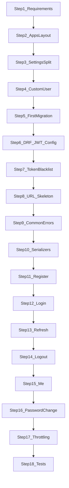

# Authentication Module — Implementation Steps

## Scope and baseline

**In scope:** Identity + JWT auth per [smart_issue_tracker_api_7e708123.plan.md](c:\Users\Hackerkernel\Desktop\smart_issue_tracker\.cursor\plans\smart_issue_tracker_api_7e708123.plan.md) Phase 2 — `apps.users`, email-based `User`, six auth/profile endpoints, token blacklist logout, auth throttling.

**Out of scope (later phases):** Projects, issues, Celery, Docker prod, `UserProfile` avatar (optional model can wait), email verification.

**Current repo state:**
- [`account/`](c:\Users\Hackerkernel\Desktop\smart_issue_tracker\account) exists but is **empty** and **not** in `INSTALLED_APPS`
- DRF + `djangorestframework-simplejwt` are in **venv only** — not in project settings
- No `requirements/` files, no `apps/` package, no migrations run for a custom user

Auth **cannot** start at “register endpoint” without Steps 1–8 below (custom `User` must exist before the first `migrate` on the users app).

---

## Target API surface (reference)

| Method | Path | Access |
|--------|------|--------|
| POST | `/api/v1/auth/register/` | Public |
| POST | `/api/v1/auth/login/` | Public |
| POST | `/api/v1/auth/refresh/` | Public (refresh body) |
| POST | `/api/v1/auth/logout/` | Authenticated |
| POST | `/api/v1/auth/password/change/` | Authenticated |
| GET/PATCH | `/api/v1/users/me/` | Authenticated |

---

## Dependency overview



**Parallelization:** None until Step 8 completes. Steps 11–16 are sequential (each endpoint reuses serializers/views from prior steps).

---

## Block A — Auth prerequisites (minimal Phase 1 slice)

These steps are not “extra features”; they are the foundation every auth endpoint depends on.

### Step 1 — Pin dependencies in `requirements/`

**Files:**
- Create [`requirements/base.txt`](requirements/base.txt) — Django, djangorestframework, djangorestframework-simplejwt, django-cors-headers (optional now), django-environ
- Create [`requirements/dev.txt`](requirements/dev.txt) — `-r base.txt` + pytest, pytest-django, factory-boy

**Why first:** Reproducible installs and documents what auth needs; matches architecture plan package list.

**Depends on:** Nothing.

**Checkpoint:** `pip install -r requirements/dev.txt` succeeds in venv.

---

### Step 2 — `apps/` package and migrate `account` → `apps.users`

**Files:**
- Create [`apps/__init__.py`](apps/__init__.py)
- Move/rename [`account/`](account) → [`apps/users/`](apps/users) (update `apps.py`: `name = 'apps.users'`)
- Update [`manage.py`](manage.py) and [`issue_tracker/wsgi.py`](issue_tracker/wsgi.py) / [`asgi.py`](issue_tracker/asgi.py) — add repo root to `sys.path` so `apps.*` imports resolve
- Delete empty [`account/`](account) after move

**Why second:** Approved layout puts identity in `apps.users`; avoids two user apps and matches `AUTH_USER_MODEL = 'users.User'` style paths.

**Depends on:** Step 1.

**Checkpoint:** `python manage.py check` finds `apps.users` (once registered in settings in Step 3).

---

### Step 3 — Split settings (auth-minimal)

**Files:**
- Create [`issue_tracker/settings/base.py`](issue_tracker/settings/base.py) — move shared config from [`issue_tracker/settings.py`](issue_tracker/settings.py)
- Create [`issue_tracker/settings/dev.py`](issue_tracker/settings/dev.py) — `DEBUG = True`, SQLite
- Create [`issue_tracker/settings/__init__.py`](issue_tracker/settings/__init__.py) — import dev by default (or use `DJANGO_SETTINGS_MODULE=issue_tracker.settings.dev`)
- Slim or replace monolithic [`settings.py`](issue_tracker/settings.py) to re-export dev (avoid two sources of truth)
- In `base.py` **INSTALLED_APPS**, add: `apps.users`, `rest_framework`, `rest_framework_simplejwt`
- Set `AUTH_USER_MODEL = 'users.User'` (after Step 4 model exists — can add setting in Step 4 same commit)

**Why third:** DRF/JWT and `apps.users` must load before models/migrations; env split prevents prod secrets leaking into dev later.

**Depends on:** Step 2.

**Checkpoint:** `python manage.py check` passes with `apps.users` installed (model may not exist yet — temporarily comment `AUTH_USER_MODEL` until Step 4 if needed).

---

### Step 4 — Custom `User` model + manager (before any migrate)

**Files:**
- [`apps/users/models.py`](apps/users/models.py) — `User(AbstractBaseUser, PermissionsMixin)` with `email` unique, `USERNAME_FIELD = 'email'`, `first_name`, `last_name`, `is_active`, timestamps
- [`apps/users/managers.py`](apps/users/managers.py) — `UserManager` with `create_user` / `create_superuser`
- [`apps/users/admin.py`](apps/users/admin.py) — register `User` for Django admin
- [`issue_tracker/settings/base.py`](issue_tracker/settings/base.py) — `AUTH_USER_MODEL = 'users.User'`

**Why fourth:** Django allows custom user only **before** the first migration that creates users; changing later requires painful reset. Email login is the core identity decision for all JWT serializers.

**Depends on:** Step 3.

**Checkpoint:** `python manage.py makemigrations users` generates initial migration (do not run yet if you want to batch with Step 7 blacklist — running after Step 4 alone is fine for learning).

**Learning note:** Read Django docs on custom user once here — this is the highest-cost reversal point in the project.

---

### Step 5 — First database migration + superuser

**Files:**
- [`apps/users/migrations/0001_initial.py`](apps/users/migrations/0001_initial.py) (generated)

**Why fifth:** Persists `User` table; unlocks `createsuperuser`, admin, and registration writing to DB.

**Depends on:** Step 4.

**Checkpoint:**
- `python manage.py migrate`
- `python manage.py createsuperuser` (email-based)
- User appears in `/admin/`

---

### Step 6 — Wire DRF + SimpleJWT defaults

**Files:**
- [`issue_tracker/settings/base.py`](issue_tracker/settings/base.py):
  - `REST_FRAMEWORK` — `DEFAULT_AUTHENTICATION_CLASSES` = JWT authentication; `DEFAULT_PERMISSION_CLASSES` = `IsAuthenticated`
  - `SIMPLE_JWT` — access 15 min, refresh 7 days, `ROTATE_REFRESH_TOKENS`, `BLACKLIST_AFTER_ROTATION` (blacklist app in Step 7)
  - `AUTH_PASSWORD_VALIDATORS` — keep Django defaults (already in base)

**Why sixth:** Every later view inherits “JWT required by default”; public endpoints explicitly opt into `AllowAny`. Token lifetimes and rotation are security decisions best set once before building views.

**Depends on:** Step 5.

**Checkpoint:** Project starts without import errors; no endpoints yet.

---

### Step 7 — Token blacklist app + migrate

**Files:**
- [`issue_tracker/settings/base.py`](issue_tracker/settings/base.py) — add `rest_framework_simplejwt.token_blacklist` to `INSTALLED_APPS`
- Blacklist migrations (generated) under site-packages when you run `migrate`

**Why seventh:** Logout (Step 14) requires `OutstandingToken` / `BlacklistedToken` tables; `BLACKLIST_AFTER_ROTATION` in Step 6 depends on this app.

**Depends on:** Step 6.

**Checkpoint:** `python manage.py migrate` shows blacklist tables; no runtime errors.

---

### Step 8 — API URL skeleton (`/api/v1/`)

**Files:**
- [`issue_tracker/urls.py`](issue_tracker/urls.py) — `path('api/v1/', include(...))`
- Create [`apps/users/urls.py`](apps/users/urls.py) — empty `urlpatterns` or placeholder names
- Optional: [`apps/users/api/__init__.py`](apps/users/api/__init__.py) for future split (views/serializers under `api/`)

**Why eighth:** Stable URL contract before implementing views; lets you add one route per step and test immediately with curl/Postman.

**Depends on:** Step 7.

**Checkpoint:** `GET /api/v1/` (or a temporary health stub) returns 404/empty, not project URLconf error.

---

### Step 9 — Shared API error shape (`apps.common` minimal)

**Files:**
- Create [`apps/common/__init__.py`](apps/common/__init__.py), [`apps/common/exceptions.py`](apps/common/exceptions.py) — custom `exception_handler` returning `{ "detail", "code", "fields" }`
- [`issue_tracker/settings/base.py`](issue_tracker/settings/base.py) — `REST_FRAMEWORK['EXCEPTION_HANDLER']`, add `apps.common` to `INSTALLED_APPS` (no models needed)

**Why before register:** Registration validation errors (duplicate email, weak password) are the first user-facing failures; consistent JSON helps clients and tests from day one.

**Depends on:** Step 8.

**Checkpoint:** Trigger a deliberate DRF validation error in a scratch view or shell — response matches planned shape.

---

## Block B — Auth API (Phase 2)

Implement **one endpoint per step**; verify with HTTP client after each.

### Step 10 — Auth serializers (no views yet)

**Files:**
- [`apps/users/serializers.py`](apps/users/serializers.py) (or `apps/users/api/serializers.py`):
  - `RegisterSerializer` — email, password, names; `create()` calls `User.objects.create_user`
  - `UserMeSerializer` — read/update safe fields (no password)
  - `PasswordChangeSerializer` — old_password, new_password
  - `EmailTokenObtainPairSerializer` — subclass SimpleJWT’s obtain serializer; `username_field = email` (or custom credential field)

**Why tenth:** Separates validation/password hashing from HTTP layer; serializers are reused by register, login, and `/me`; easiest to unit test in isolation.

**Depends on:** Steps 4–9.

**Checkpoint:** Serializer unit tests (optional mid-step) or `manage.py shell` — `RegisterSerializer` creates inactive/active user correctly.

---

### Step 11 — Register endpoint

**Files:**
- [`apps/users/views.py`](apps/users/views.py) — `RegisterView` (APIView or GenericAPIView): `permission_classes = [AllowAny]`, `POST` only
- [`apps/users/urls.py`](apps/users/urls.py) — `auth/register/`
- Wire in root [`issue_tracker/urls.py`](issue_tracker/urls.py) if not already

**Why eleventh:** Creates users without tokens first — simplest public flow; proves DB + serializers before JWT issuance complexity.

**Depends on:** Step 10.

**Checkpoint:** `POST /api/v1/auth/register/` → `201` + user payload (no tokens yet, or tokens if you choose to auto-login — plan allows either; recommend **201 without tokens** first, then login explicitly for learning).

---

### Step 12 — Login endpoint (issue tokens)

**Files:**
- [`apps/users/views.py`](apps/users/views.py) — `LoginView` subclassing `TokenObtainPairView`, serializer = `EmailTokenObtainPairSerializer`
- [`apps/users/urls.py`](apps/users/urls.py) — `auth/login/`

**Why twelfth:** Depends on existing users from register; teaches JWT pair response (`access`, `refresh`) and email-as-identifier.

**Depends on:** Step 11.

**Checkpoint:** Register → login → receive access + refresh tokens.

---

### Step 13 — Refresh endpoint

**Files:**
- [`apps/users/views.py`](apps/users/views.py) — thin wrapper or direct use of `TokenRefreshView`
- [`apps/users/urls.py`](apps/users/urls.py) — `auth/refresh/`

**Why thirteenth:** Requires valid refresh token from login; validates `SIMPLE_JWT` rotation settings before logout blacklisting.

**Depends on:** Step 12.

**Checkpoint:** Login → refresh → new access token works on authenticated call.

---

### Step 14 — Logout endpoint (blacklist refresh)

**Files:**
- [`apps/users/views.py`](apps/users/views.py) — `LogoutView`: authenticated, accepts `refresh` in body, calls `RefreshToken(refresh).blacklist()`
- [`apps/users/urls.py`](apps/users/urls.py) — `auth/logout/`

**Why fourteenth:** Needs blacklist tables (Step 7) and refresh token from login; completes secure session teardown story.

**Depends on:** Steps 7, 12, 13.

**Checkpoint:** Login → logout → same refresh token rejected on refresh.

---

### Step 15 — `/users/me/` profile endpoint

**Files:**
- [`apps/users/views.py`](apps/users/views.py) — `MeView` — `GET` returns current user, `PATCH` partial update
- [`apps/users/urls.py`](apps/users/urls.py) — `users/me/`

**Why fifteenth:** Requires working `Authorization: Bearer` header — proves default `IsAuthenticated` and JWT authentication class end-to-end.

**Depends on:** Step 12.

**Checkpoint:** Login → `GET/PATCH /api/v1/users/me/` with access token.

---

### Step 16 — Password change endpoint

**Files:**
- [`apps/users/views.py`](apps/users/views.py) — `PasswordChangeView` — authenticated, uses `PasswordChangeSerializer`, `user.set_password` + save
- [`apps/users/urls.py`](apps/users/urls.py) — `auth/password/change/`

**Why sixteenth:** Builds on authenticated identity from Step 15; uses Django password validators; should invalidate old sessions optionally (document: refresh tokens remain valid until logout/blacklist — acceptable for MVP).

**Depends on:** Steps 10, 15.

**Checkpoint:** Change password → login with new password succeeds, old password fails.

---

### Step 17 — Auth throttling

**Files:**
- [`apps/common/throttling.py`](apps/common/throttling.py) — e.g. `AuthAnonRateThrottle`, `AuthUserRateThrottle` (stricter scopes)
- [`issue_tracker/settings/base.py`](issue_tracker/settings/base.py) — register throttle classes and rates in `REST_FRAMEWORK`
- [`apps/users/views.py`](apps/users/views.py) — attach throttle_classes on register/login/refresh

**Why seventeenth:** Applied after endpoints work so you can observe 429 behavior; security hardening without blocking learning of core flows.

**Depends on:** Steps 11–16.

**Checkpoint:** Burst register/login requests → `429 Too Many Requests`.

---

### Step 18 — Auth test suite

**Files:**
- [`pytest.ini`](pytest.ini) or `pyproject.toml` pytest config
- [`tests/conftest.py`](tests/conftest.py) — APIClient, user factory
- [`apps/users/tests/test_auth.py`](apps/users/tests/test_auth.py) — register, login, refresh, logout, me, password change, throttle smoke

**Why last:** Tests encode the contract; writing them after endpoints avoids rewriting tests during exploratory API tweaks. Still valuable for regression before Phase 3 (projects RBAC).

**Depends on:** Steps 11–17.

**Checkpoint:** `pytest apps/users/tests` green.

---

## Suggested folder layout after auth module

```text
apps/
  common/
    exceptions.py
    throttling.py
  users/
    models.py
    managers.py
    admin.py
    serializers.py
    views.py
    urls.py
    migrations/
tests/
  conftest.py
apps/users/tests/test_auth.py
issue_tracker/
  settings/
    base.py
    dev.py
  urls.py
requirements/
  base.txt
  dev.txt
```

---

## Learning milestones (manual checklist)

After **Step 5:** Understand custom User + migrations.  
After **Step 12:** Understand access vs refresh JWT.  
After **Step 14:** Understand blacklist vs “delete token on client only”.  
After **Step 17:** Understand defense-in-depth (throttle + rotation + blacklist).

---

## What to defer (avoid scope creep in auth module)

| Item | Defer to |
|------|----------|
| `UserProfile` (avatar, timezone) | Post-MVP or with notifications |
| Email verification | Phase 2+ hook |
| OpenAPI (`drf-spectacular`) | Phase 9 quality gate |
| CORS production allowlist | Docker/prod phase |
| Split `views.py` into `api/auth.py`, `api/me.py` | Optional refactor after Step 18 passes |

---

## Exit criteria (auth module done)

- All six endpoints live under `/api/v1/`
- Email is the only login identifier
- Logout blacklists refresh; rotation enabled
- Default DRF permission is authenticated; auth routes use `AllowAny` explicitly
- Auth endpoints throttled
- Pytest auth flow green
- Ready for **Phase 3 — Projects RBAC** (will import `settings.AUTH_USER_MODEL`, not `apps.users` views)
