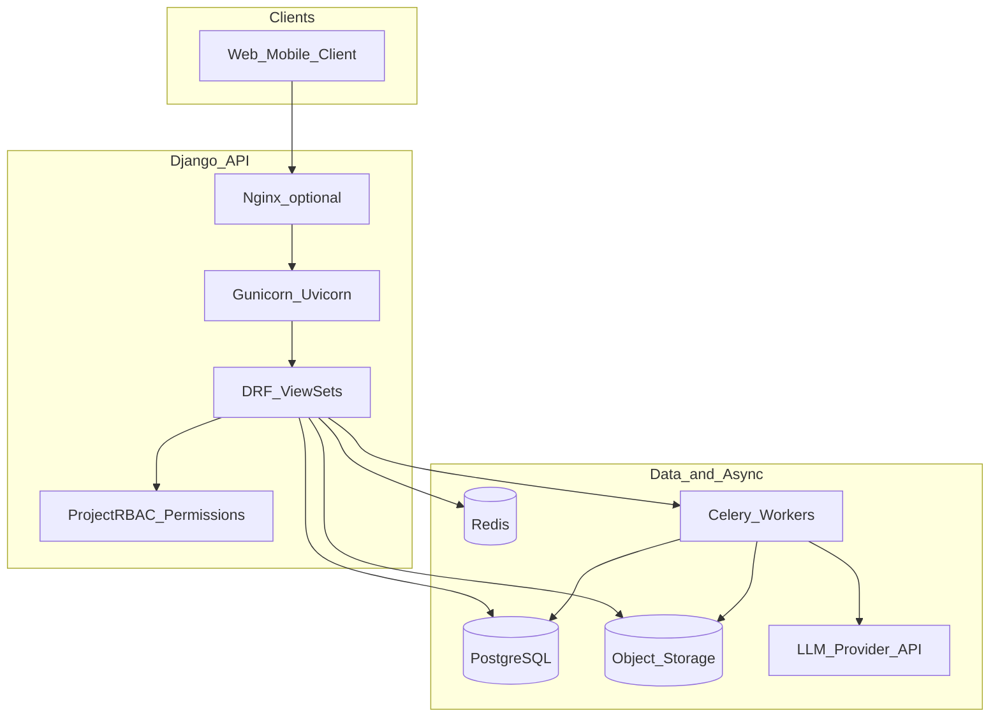
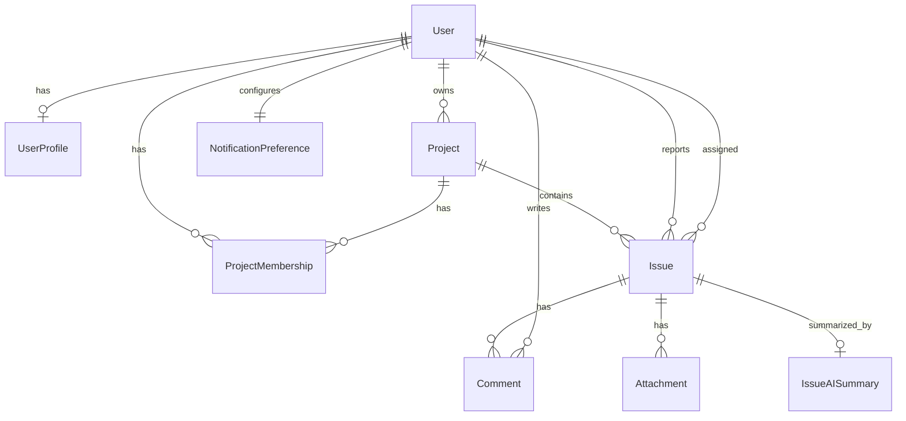
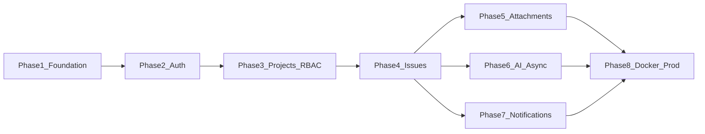

# Smart Issue Tracker API — Architecture Plan

## Current baseline

You already have:

- Django project: [`issue_tracker/`](c:\Users\Hackerkernel\Desktop\smart_issue_tracker\issue_tracker)
- Empty app: [`account/`](c:\Users\Hackerkernel\Desktop\smart_issue_tracker\account)
- Installed in venv (not wired): DRF 3.17, `djangorestframework-simplejwt` 5.5
- Default SQLite in [`issue_tracker/settings.py`](c:\Users\Hackerkernel\Desktop\smart_issue_tracker\issue_tracker\settings.py)

This plan refactors toward a **modular monolith**: one deployable API, clear app boundaries, project-scoped authorization, and async work off the request path.

---

## 1. Project folder architecture

Target layout (new folders/files shown; existing `manage.py` stays at repo root):

```text
smart_issue_tracker/
├── manage.py
├── requirements/
│   ├── base.txt
│   ├── dev.txt
│   └── prod.txt
├── docker/
│   ├── Dockerfile
│   ├── docker-compose.yml
│   ├── docker-compose.dev.yml
│   └── entrypoint.sh
├── .env.example
├── README.md
├── issue_tracker/                 # Django project package (rename optional later)
│   ├── __init__.py
│   ├── urls.py                    # Root URL router only
│   ├── asgi.py
│   ├── wsgi.py
│   ├── celery.py                  # Celery app instance
│   └── settings/
│       ├── __init__.py            # Imports base + env overlay
│       ├── base.py
│       ├── dev.py
│       └── prod.py
├── apps/                          # All domain apps live here (PYTHONPATH)
│   ├── __init__.py
│   ├── common/                    # Shared infra (not a “feature”)
│   ├── users/                     # Evolve from `account` (see note below)
│   ├── projects/
│   ├── issues/
│   ├── notifications/
│   └── ai/
├── media/                         # Dev local uploads (gitignored)
├── staticfiles/                   # collectstatic output (gitignored)
└── tests/                         # Cross-app integration tests (optional)
    └── conftest.py
```

**Design choices**

| Concern | Decision |
|--------|----------|
| Settings | Split `base` / `dev` / `prod`; secrets from env only in prod |
| Apps location | `apps/` package keeps domain code out of project config |
| `account` app | **Rename/migrate to `apps.users`** (identity + JWT endpoints); avoid two user apps |
| API surface | Versioned prefix: `/api/v1/` |
| Storage | Dev: local `MEDIA_ROOT`; Prod: S3-compatible via `django-storages` |
| DB | Dev: SQLite acceptable; Prod: PostgreSQL (Docker) |



---

## 2. App structure (per app responsibilities)

### `apps.common`
Shared foundation—not business features.

- **Models**: `TimeStampedModel`, `UUIDModel` (optional public IDs), `SoftDeleteModel` (optional for issues)
- **Permissions**: base DRF permission classes, `IsProjectMember`, role helpers
- **Exceptions**: unified API exception handler + error shape `{ "detail", "code", "fields" }`
- **Pagination**: cursor pagination default (scalable lists); page size cap
- **Throttling**: reusable rate limit classes
- **Storage**: upload validators (size, MIME allowlist)
- **Managers**: queryset helpers for project scoping

### `apps.users` (from existing `account`)
Identity and authentication only.

- Custom `User` (`email` as `USERNAME_FIELD`)
- Registration, login, refresh, logout (blacklist), password change
- `/me` profile endpoint
- No project/issue logic here

### `apps.projects`
Workspace boundary + **project-scoped RBAC** (your choice: no global app roles beyond Django `is_staff` for admin site).

- `Project`, `ProjectMembership`, role enum
- Member invite/remove, role change (Owner/Admin only)
- Slug-based project lookup in URLs

### `apps.issues`
Core tracker domain.

- `Issue`, `Comment`, `Attachment`
- Status/priority enums, assignee, reporter
- Nested routes under project: `/projects/{slug}/issues/...`
- Activity-friendly fields: `updated_at`, optional `IssueHistory` later (out of MVP schema)

### `apps.notifications`
Preferences now; delivery pipeline later.

- `NotificationPreference` per user (global defaults)
- Optional `ProjectNotificationOverride` if you need per-project toggles later
- Celery tasks stub for email/push (implement after preferences API is stable)

### `apps.ai`
AI summaries isolated for scaling and cost control.

- `IssueAISummary` model + generation task
- Service layer calling LLM with timeouts, retries, token limits
- Never block HTTP on LLM calls—always enqueue Celery task

**Cross-app rule**: Foreign keys point **inward** (issues → projects → users). No circular imports; use `settings.AUTH_USER_MODEL` string references.

---

## 3. Database schema

PostgreSQL-oriented. Use `BigAutoField` / `UUIDField` for public resources as needed. All tables include `created_at` / `updated_at` unless noted.

### Users (`apps.users`)

| Model | Key fields | Constraints / notes |
|-------|------------|----------------------|
| **User** | `id`, `email` (unique), `password`, `first_name`, `last_name`, `is_active`, `last_login` | `USERNAME_FIELD = email`; create custom user **before first migration** |
| **UserProfile** (optional) | `user` (1:1), `avatar`, `timezone`, `bio` | Keeps User lean |

### Projects (`apps.projects`)

| Model | Key fields | Constraints / notes |
|-------|------------|----------------------|
| **Project** | `id`, `name`, `slug` (unique), `description`, `owner_id` (FK User), `is_archived`, timestamps | Index: `slug`; filter archived by default |
| **ProjectMembership** | `id`, `project_id`, `user_id`, `role`, `joined_at` | **Unique** `(project, user)`; index `(project, role)` |
| **ProjectRole** (choices) | `OWNER`, `ADMIN`, `MEMBER`, `VIEWER` | Enforced in permissions + DB check |

**Role capability matrix** (enforce in permission classes, not only serializers):

| Action | Owner | Admin | Member | Viewer |
|--------|-------|-------|--------|--------|
| Delete project | Yes | No | No | No |
| Manage members / roles | Yes | Yes | No | No |
| Create/edit issues | Yes | Yes | Yes | No |
| Comment | Yes | Yes | Yes | No |
| View issues | Yes | Yes | Yes | Yes |
| Upload attachments | Yes | Yes | Yes | No |
| Trigger AI summary | Yes | Yes | Yes | No |

### Issues (`apps.issues`)

| Model | Key fields | Constraints / notes |
|-------|------------|----------------------|
| **Issue** | `id`, `project_id`, `number` (int, per-project), `title`, `description`, `status`, `priority`, `reporter_id`, `assignee_id` (nullable), `due_date` (nullable), timestamps | **Unique** `(project, number)`; indexes: `(project, status)`, `(project, assignee)`, `(project, updated_at DESC)` |
| **Comment** | `id`, `issue_id`, `author_id`, `body`, `is_edited`, timestamps | Index `(issue, created_at)` |
| **Attachment** | `id`, `issue_id`, `uploaded_by_id`, `file`, `original_filename`, `content_type`, `size_bytes`, `checksum` (optional), `created_at` | Max size enforced in validator; index `(issue)` |

**Enums**

- `IssueStatus`: `open`, `in_progress`, `in_review`, `closed`
- `IssuePriority`: `low`, `medium`, `high`, `critical`

**Issue numbering**: allocate `number` via `select_for_update` on project row or dedicated counter row to avoid race conditions under concurrency.

### AI (`apps.ai`)

| Model | Key fields | Constraints / notes |
|-------|------------|----------------------|
| **IssueAISummary** | `id`, `issue_id`, `summary_text`, `model_name`, `prompt_version`, `status` (`pending`/`completed`/`failed`), `error_message`, `input_tokens`, `output_tokens`, `generated_at`, `requested_by_id` | **One active summary** policy: either unique `(issue)` for latest-only, or keep history with `is_current` flag; index `(issue, status)` |

### Notifications (`apps.notifications`)

| Model | Key fields | Constraints / notes |
|-------|------------|----------------------|
| **NotificationPreference** | `id`, `user_id` (1:1), `email_enabled`, `in_app_enabled`, bitfield/JSON for event toggles | Events: `issue_assigned`, `issue_commented`, `issue_status_changed`, `mention`, `ai_summary_ready` |
| **Notification** (phase 2) | `id`, `user_id`, `event_type`, `payload` (JSON), `read_at`, `created_at` | In-app inbox; optional for MVP API list |

### JWT (library tables)

Enable `rest_framework_simplejwt.token_blacklist` for logout/rotation—adds `OutstandingToken` / `BlacklistedToken` tables.

### ER diagram



---

## 4. API list (v1)

Base: `/api/v1/` — JSON only, JWT in `Authorization: Bearer <access>`.

### Auth (`apps.users`)

| Method | Path | Access | Purpose |
|--------|------|--------|---------|
| POST | `/auth/register/` | Public | Create user |
| POST | `/auth/login/` | Public | Access + refresh tokens |
| POST | `/auth/refresh/` | Public (refresh token) | Rotate access |
| POST | `/auth/logout/` | Authenticated | Blacklist refresh |
| POST | `/auth/password/change/` | Authenticated | Change password |
| GET/PATCH | `/users/me/` | Authenticated | Profile |

### Projects (`apps.projects`)

| Method | Path | Access | Purpose |
|--------|------|--------|---------|
| GET/POST | `/projects/` | Auth | List (member) / create |
| GET/PATCH/DELETE | `/projects/{slug}/` | Member / Owner | Detail, update, delete |
| GET/POST | `/projects/{slug}/members/` | Admin+ | List / invite add member |
| PATCH/DELETE | `/projects/{slug}/members/{user_id}/` | Admin+ | Change role / remove |
| GET | `/projects/{slug}/members/me/` | Member | Current user’s role |

### Issues (`apps.issues`)

| Method | Path | Access | Purpose |
|--------|------|--------|---------|
| GET/POST | `/projects/{slug}/issues/` | Member+ / Member+ | List (filter, cursor paginate) / create |
| GET/PATCH/DELETE | `/projects/{slug}/issues/{number}/` | Viewer+ / Member+ / Admin+ | Detail, update, soft-delete |
| GET/POST | `/projects/{slug}/issues/{number}/comments/` | Viewer+ / Member+ | Thread |
| PATCH/DELETE | `.../comments/{id}/` | Author or Admin+ | Edit/delete own |
| GET/POST | `/projects/{slug}/issues/{number}/attachments/` | Viewer+ / Member+ | List / upload (multipart) |
| DELETE | `.../attachments/{id}/` | Uploader or Admin+ | Remove |

**Query params (issues list)**: `status`, `priority`, `assignee`, `reporter`, `search`, `ordering`, `cursor`.

### AI (`apps.ai`)

| Method | Path | Access | Purpose |
|--------|------|--------|---------|
| POST | `/projects/{slug}/issues/{number}/ai-summary/` | Member+ | Enqueue generation (202 Accepted) |
| GET | `/projects/{slug}/issues/{number}/ai-summary/` | Viewer+ | Latest summary + status |

### Notifications (`apps.notifications`)

| Method | Path | Access | Purpose |
|--------|------|--------|---------|
| GET/PATCH | `/users/me/notification-preferences/` | Auth | Read/update toggles |

### Ops / docs

| Method | Path | Access | Purpose |
|--------|------|--------|---------|
| GET | `/health/` | Public | Liveness (DB + Redis ping) |
| GET | `/schema/` | Dev only | OpenAPI (drf-spectacular) |

**Response conventions**

- `201` + `Location` on create; `202` for async AI enqueue
- `403` vs `404`: return **404** when user is not a project member (avoid leaking project existence)
- Consistent error body from `common` exception handler

---

## 5. Security considerations

### Authentication and tokens
- **JWT**: short-lived access (15 min), refresh (7 days), rotation enabled, blacklist on logout
- **HTTPS only** in prod; `SECURE_SSL_REDIRECT`, HSTS, secure cookies if any session use
- **Registration**: email verification (phase 2 hook); rate-limit register/login
- **Password**: Django validators + optional breach check (django-password-validators)

### Authorization
- **Project-scoped RBAC only** — every queryset filtered by membership; object-level checks on `issue.project_id`
- **404 obfuscation** for cross-tenant access
- **Role changes**: only Owner/Admin; prevent removing last Owner
- **Django admin**: `is_staff` separate from project roles; disable default user listing in prod

### API hardening
- **DRF**: `DEFAULT_PERMISSION_CLASSES = IsAuthenticated`, explicit `AllowAny` only on auth/register/health
- **Throttling**: anon + user buckets; stricter on auth and AI endpoints
- **CORS**: explicit allowlist from env
- **CSRF**: not required for JWT API; keep CSRF middleware for admin only

### File attachments
- Allowlist MIME + extension; max size (e.g. 10–25 MB)
- Store outside web root; serve via signed URLs (S3) or authenticated download view
- Sanitize `original_filename`; optional virus scan hook in Celery before marking attachment active
- Do not expose internal storage paths in API

### AI integration
- Redact secrets from issue text before LLM call
- Cap description length sent to model; log `prompt_version` not raw prompts in prod logs
- API keys in env only; timeout + circuit breaker; user must be project Member+ to enqueue

### Infrastructure (Docker prod)
- Non-root container user; read-only filesystem where possible
- Secrets via env / secret manager — **rotate** the committed `SECRET_KEY` in current settings before deploy
- PostgreSQL: least-privilege DB user; connection pooling (pgBouncer) at scale
- Redis: password, internal network only
- Structured logging + request ID; no PII in debug logs

### Dependencies and supply chain
- Pin versions in `requirements/*.txt`; run `pip-audit` / Dependabot in CI

---

## 6. Recommended implementation order

Phased delivery minimizes rework (custom User and settings split must come first).



| Phase | Scope | Exit criteria |
|-------|--------|----------------|
| **1 — Foundation** | Split settings; `apps.common`; wire DRF, JWT settings, exception handler, pagination; rename `account` → `apps.users`; custom User + migrations | `migrate` clean; `/health/` returns OK |
| **2 — Auth API** | Register, login, refresh, logout, `/me`; blacklist app; throttling on auth | Postman collection auth flow works |
| **3 — Projects + RBAC** | Project + Membership models; permission matrix; project/member APIs | Non-member gets 404; role matrix enforced |
| **4 — Issues core** | Issue numbering; CRUD + filters; comments API | Member can CRUD; Viewer read-only |
| **5 — Attachments** | Upload validation; local dev storage; prod storages config | Multipart upload + authorized download |
| **6 — AI summaries** | Celery + Redis; `IssueAISummary`; enqueue + poll endpoints | POST returns 202; worker fills summary |
| **7 — Notifications** | `NotificationPreference` API; Celery stubs firing on issue events | PATCH preferences; events respect toggles |
| **8 — Docker & prod** | `Dockerfile`, compose (web, postgres, redis, celery worker/beat); `.env.example`; prod settings (PostgreSQL, S3, security flags) | `docker compose up` runs full stack |
| **9 — Quality gate** | OpenAPI schema; pytest coverage for RBAC matrix; CI pipeline | RBAC regression tests green |

**Parallelization after Phase 4**: Phases 5, 6, and 7 can proceed in parallel by different developers once project/issue permissions are stable.

---

## Key packages (requirements planning)

`base.txt`: Django, djangorestframework, djangorestframework-simplejwt, django-filter, django-cors-headers, celery, redis, psycopg[binary], django-environ, drf-spectacular  

`prod.txt`: gunicorn, django-storages[boto3], whitenoise (if serving static admin)  

`dev.txt`: pytest, pytest-django, factory-boy, ipdb, coverage  

---

## Migration note for existing repo

- Move [`account/`](c:\Users\Hackerkernel\Desktop\smart_issue_tracker\account) → `apps/users/` (or keep name `account` inside `apps/` but **`users` is clearer**)
- Introduce `apps/` on `PYTHONPATH` via `manage.py` / `wsgi.py` path tweak
- Delete default SQLite-only assumptions before production Docker work

No implementation code in this phase—next step after approval is **Phase 1 (Foundation)** only.
